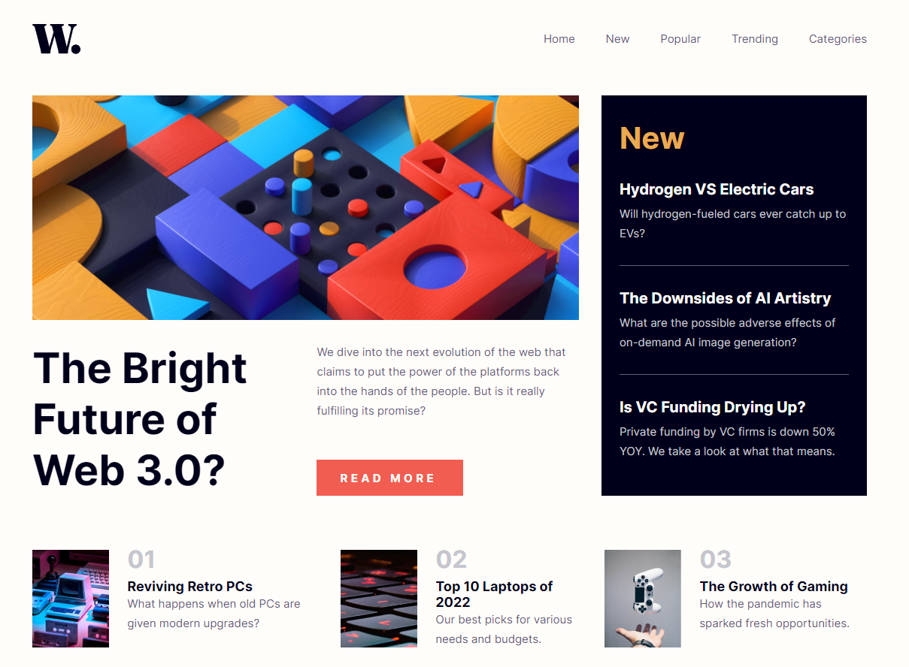

# Frontend Mentor - News homepage solution

This is a solution to the [News homepage challenge on Frontend Mentor](https://www.frontendmentor.io/challenges/news-homepage-H6SWTa1MFl). Frontend Mentor challenges help you improve your coding skills by building realistic projects. 

## Table of contents

- [Overview](#overview)
  - [The challenge](#the-challenge)
  - [Screenshot](#screenshot)
  - [Links](#links)
- [My process](#my-process)
  - [Built with](#built-with)
  - [What I learned](#what-i-learned)
  - [Continued development](#continued-development)
- [Author](#author)

## Overview

### The challenge

Users should be able to:

- View the optimal layout for the interface depending on their device's screen size
- See hover and focus states for all interactive elements on the page

### Screenshot



### Links

- Solution URL: [Solution URL](https://www.frontendmentor.io/solutions/news-homepage-build-with-html-cssflexbox-and-vanilla-js-5oRy5Xr5yH)
- Live Site URL: [live site URL](https://news-homepage-hub.netlify.app/)

## My process

### Built with

- Semantic HTML5 markup
- CSS custom properties
- Flexbox
- Vailla JS
- Figma

### What I learned

In this project i practice my skills in CSS specially using flexbox to layout the news. I put into practice my programming logic using JS to toggle the menu on mobile.

Some code i'm proud of:

```js
openIcon.addEventListener('click', () => {
    mobileMenu.classList.remove('mobile-menu-container-close');
    mobileMenu.classList.add('mobile-menu-container');
    mobileLayer.classList.add('mobile-bg-layer');
    mobileLayer.classList.remove('mobile-bg-layer-hide');
})
```

### Continued development

Definitely i want to work on my skills in JavaScript and CSS by continuing building projects and also want to learn a JS framework/library like REACT or Angular.

## Author

- Website - [Max López](https://github.com/maxlopzb)
- Frontend Mentor - [@maxlopzb](https://www.frontendmentor.io/profile/maxlopzb)

